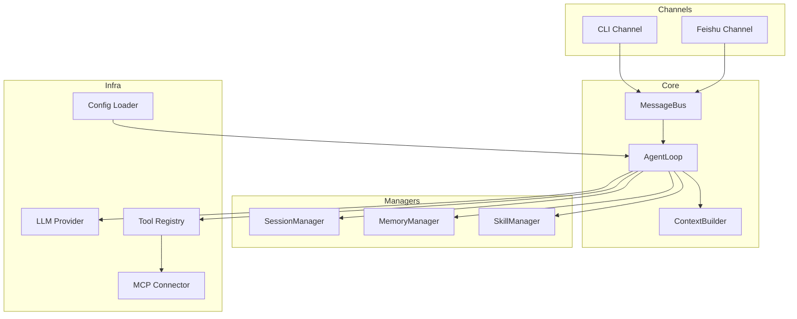
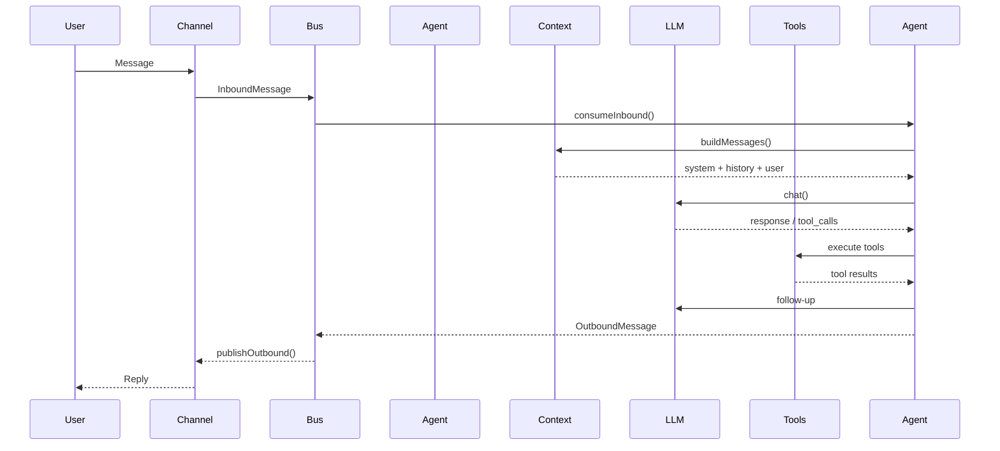
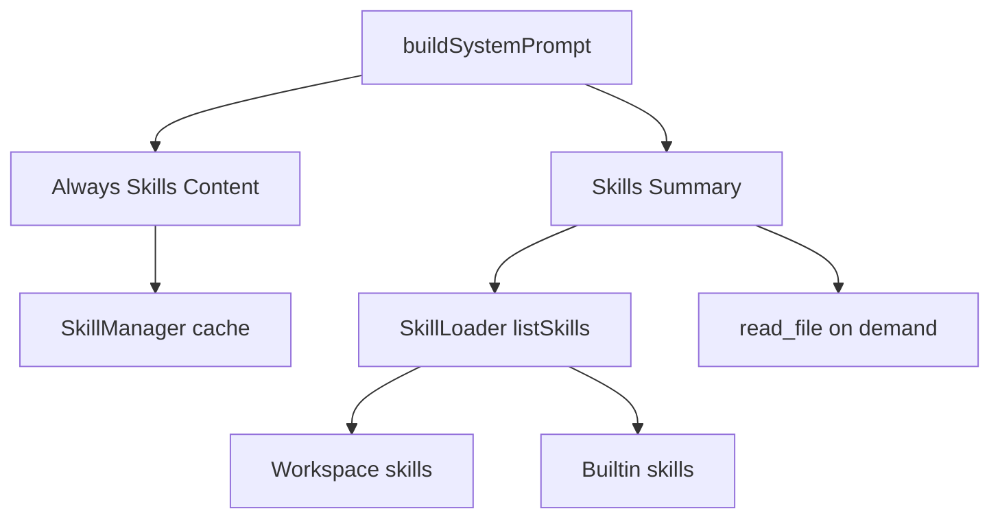

# octobot 🐙

[](https://www.typescriptlang.org/)
[](https://nodejs.org/)
[](LICENSE)

English | [简体中文](docs/README.zh.md)

octobot is a modular AI agent framework built in TypeScript. It focuses on multi-channel interaction, session and memory management, skill expansion, and tool orchestration for engineering workflows. Inspired by [nanobot](https://github.com/danielmiessler/nanobot).

## Highlights

- Multi-LLM support (OpenAI, Anthropic, VolcEngine, DeepSeek, Gemini, Zhipu, Moonshot, and more)
- Multi-channel access (CLI and Feishu bot)
- Dual memory model (MEMORY.md + HISTORY.md)
- Skill system based on SKILL.md with dependency checks and on-demand loading
- MCP integration for Model Context Protocol servers
- Message bus architecture for decoupled channels and core loop
- Tooling for files, shell, web search/fetch, subagents, and cron
- JSONL session persistence with multi-session support

## Quick Start

### Install (recommended)

```bash
npm i -g octobot
```

### Install from source

```bash
git clone https://github.com/yourusername/octobot.git
cd octobot
npm install
npm run build
npm link
```

### Initialize

```bash
octobot onboard
```

### Configure

Config file: `~/.octobot/config.json`

```json
{
  "agents": {
    "defaults": {
      "workspace": "~/.octobot/workspace",
      "model": "ark-code-latest",
      "provider": "volcengine",
      "max_tokens": 8192,
      "temperature": 0.1,
      "max_tool_iterations": 40,
      "memory_window": 100
    }
  },
  "providers": {
    "volcengine": {
      "api_key": "YOUR_API_KEY",
      "api_base": "https://ark.cn-beijing.volces.com/api/coding/v3"
    }
  },
  "tools": {
    "web": {
      "search": {
        "api_key": "TAVILY_API_KEY",
        "max_results": 5
      }
    },
    "exec": {
      "timeout": 60,
      "path_append": ""
    },
    "restrict_to_workspace": false
  },
  "channels": {
    "feishu": {
      "enabled": false,
      "app_id": "",
      "app_secret": ""
    }
  }
}
```

### Run

```bash
# Start interactive CLI chat
octobot agent

# Start Feishu gateway (requires channels.feishu config)
octobot gateway
```

## Usage

### CLI

```text
› hello
octobot: Hello! How can I help?
```

### Feishu

1. Create a bot in Feishu Open Platform
2. Configure `channels.feishu.app_id` and `channels.feishu.app_secret`
3. Run `octobot gateway`
4. Mention the bot in Feishu to start a conversation

## Tools and Skills

### Built-in Tools

| Tool | Description |
|------|-------------|
| `read_file` | Read file contents |
| `write_file` | Write file contents |
| `edit_file` | Edit file contents |
| `list_dir` | List directory |
| `exec` | Execute shell command with safety checks |
| `web_search` | Web search (Tavily) |
| `web_fetch` | Fetch and extract web content |
| `message` | Send a message to a channel |
| `spawn` | Subagent task |
| `cron` | Schedule task |

### Skill Format

Skills live at `{workspace}/skills/<skill>/SKILL.md` and use frontmatter + markdown.

```markdown
---
name: tmux
description: Control tmux sessions
always: false
metadata: {"octobot": {"requires": {"bins": ["tmux"]}}}
---

# tmux Skill
Use tmux to manage terminal sessions...
```

## Architecture

- Channels: CLI / Feishu
- Core: AgentLoop + MessageBus
- Managers: Session / Memory / Skills
- Infra: LLM Provider / Tools / Config

### System Overview



### Message Flow



### Skill Loading



## MCP Integration

```json
{
  "mcp": {
    "enabled": true,
    "servers": {
      "sqlite": {
        "command": "npx",
        "args": ["-y", "@modelcontextprotocol/server-sqlite", "./data.db"]
      }
    }
  }
}
```

MCP servers: https://github.com/modelcontextprotocol/servers

## Development

```bash
npm run dev
npm run dev:gateway
```

`dev` and `dev:gateway` watch `src` and restart on changes.

## Contributing

- Run TypeScript checks: `npx tsc --noEmit`
- Follow existing code style
- Update docs for functional changes

## License

[MIT](LICENSE)

## Acknowledgements

- Inspired by [nanobot](https://github.com/danielmiessler/nanobot)
- Feishu SDK: [@larksuiteoapi/node-sdk](https://github.com/larksuite/node-sdk)
