# octobot 🐙

[](https://www.typescriptlang.org/)
[](https://nodejs.org/)
[](LICENSE)

> 一个功能完整的且前端友好的轻量级 openclaw，灵感来自 [nanobot](https://github.com/danielmiessler/nanobot) 🐈，使用 TypeScript 实现。

octobot 是一个模块化的 AI Agent 开发框架，支持多 LLM 提供商、多通道交互、会话管理、记忆系统和技能扩展。它让开发者能够快速构建具有长期记忆、工具调用和多平台集成能力的 AI 应用。

## ✨ 核心特性

- 🤖 **多 LLM 支持** - OpenAI、Anthropic、VolcEngine、DeepSeek、Gemini、智谱、Moonshot 等
- 💬 **多通道交互** - CLI 命令行、飞书机器人（支持 WebSocket 长连接）
- 🧠 **双层记忆系统** - MEMORY.md（长期事实）+ HISTORY.md（可搜索历史）
- 📦 **技能系统** - 通过 SKILL.md 动态扩展 Agent 能力
- 🔗 **MCP 支持** - 集成 Model Context Protocol 服务器，扩展工具能力
- 🚌 **消息总线** - 基于生产者-消费者模式的异步消息队列
- 🛠️ **丰富工具集** - 文件操作、命令执行、网络搜索、消息发送、子代理、定时任务
- 💾 **会话持久化** - JSONL 格式存储，支持多会话并发
- ⏹️ **任务取消** - 支持 `/stop` 命令取消正在执行的任务

## 🚀 快速开始

### 安装

```bash
# 克隆仓库
git clone https://github.com/yourusername/octobot.git
cd octobot

# 安装依赖
npm install
```

### 配置

创建 `.env` 文件：

```bash
# 选择 LLM 提供商（推荐国内用户使用 VolcEngine）
VOLCENGINE_API_KEY=your_api_key_here
LLM_MODEL=ark-code-latest

# 运行模式：cli 或 feishu
MODE=cli

# 飞书配置（可选，用于飞书机器人模式）
FEISHU_APP_ID=cli_xxxxxxxxxxxxxx
FEISHU_APP_SECRET=xxxxxxxxxxxxxxxxxxxxxxxxx
```

### 运行

```bash
# CLI 模式
npm start

# 飞书机器人模式
MODE=feishu npm start
```

## 📖 使用指南

### CLI 模式

```bash
$ npm start

🤖 Agent loop started
💬 You: 你好
🤖 Assistant: 你好！我是 octobot，有什么可以帮助你的吗？
```

### 飞书机器人模式

1. 在飞书开放平台创建机器人
2. 配置 `FEISHU_APP_ID` 和 `FEISHU_APP_SECRET`
3. 运行 `MODE=feishu npm start`
4. 在飞书中 @机器人开始对话

### 支持的 LLM 提供商

| 提供商 | 环境变量 | 示例模型 |
|--------|----------|----------|
| VolcEngine | `VOLCENGINE_API_KEY` | `ark-code-latest` |
| OpenAI | `OPENAI_API_KEY` | `gpt-4o-mini` |
| Anthropic | `ANTHROPIC_API_KEY` | `claude-3.5-sonnet` |
| DeepSeek | `DEEPSEEK_API_KEY` | `deepseek-chat` |
| Gemini | `GEMINI_API_KEY` | `gemini-pro` |
| 智谱 AI | `ZHIPUAI_API_KEY` | `glm-4` |
| Moonshot | `MOONSHOT_API_KEY` | `kimi-k2.5` |

## 🏗️ 架构设计

```mermaid
flowchart TB
    subgraph octobot["🐙 octobot"]
        direction TB
        
        subgraph channels["通道层"]
            CLI[CLI 通道]
            Feishu[飞书通道]
            Others[其他通道...]
        end
        
        subgraph core["核心层"]
            Bus["MessageBus<br/>消息队列"]
            Agent["AgentLoop<br/>核心处理逻辑"]
        end
        
        subgraph managers["管理器层"]
            Session["Session Manager<br/>会话管理"]
            Memory["Memory Manager<br/>记忆系统"]
            Skills["Skills Manager<br/>技能系统"]
        end
        
        subgraph infra["基础设施"]
            LLM["LLM Provider<br/>多模型支持"]
            Tools["Tool Registry<br/>工具注册表"]
            Config["Config System<br/>配置系统"]
        end
    end
    
    CLI --> Bus
    Feishu --> Bus
    Others --> Bus
    
    Bus -->|生产者-消费者模式| Agent
    
    Agent --> Session
    Agent --> Memory
    Agent --> Skills
    
    Agent --> LLM
    Agent --> Tools
    
    style octobot fill:#1a1a2e,stroke:#16213e,stroke-width:3px
    style Bus fill:#0f3460,stroke:#e94560,stroke-width:2px
    style Agent fill:#533483,stroke:#e94560,stroke-width:2px
    style channels fill:#16213e,stroke:#0f3460
    style core fill:#16213e,stroke:#0f3460
    style managers fill:#16213e,stroke:#0f3460
    style infra fill:#16213e,stroke:#0f3460
```



### 核心模块

| 模块 | 路径 | 功能 |
|------|------|------|
| **Agent Loop** | `src/agent/loop.ts` | 核心处理循环，协调各模块 |
| **Context Builder** | `src/agent/context.ts` | 构建 LLM 提示词 |
| **Message Bus** | `src/bus/` | 消息队列，解耦通道和 Agent |
| **Session Manager** | `src/session/` | 会话持久化（JSONL） |
| **Memory Manager** | `src/memory/` | 双层记忆系统 |
| **Skill Manager** | `src/skill/` | 技能加载和管理 |
| **Tool Registry** | `src/agent/tools/` | 工具注册和执行 |
| **LLM Provider** | `src/providers/` | 多 LLM 提供商支持 |

## 🛠️ 工具列表

### 内置工具

| 工具 | 描述 | 示例 |
|------|------|------|
| `read_file` | 读取文件内容 | 读取代码文件、配置文件 |
| `write_file` | 写入文件 | 创建新文件、保存结果 |
| `edit_file` | 编辑文件 | 查找替换文本 |
| `list_dir` | 列出目录 | 浏览项目结构 |
| `exec` | 执行命令 | 运行 shell 命令（带安全模式） |
| `web_search` | 网络搜索 | DuckDuckGo 搜索 |
| `web_fetch` | 网页获取 | 获取网页内容并提取可读文本 |
| `message` | 发送消息 | 发送回复给用户 |
| `spawn` | 子代理 | 后台执行长时间任务 |
| `cron` | 定时任务 | 创建定时执行的任务 |

### MCP 工具

通过配置 MCP 服务器，可以扩展更多工具能力：

```json
{
  "mcp": {
    "enabled": true,
    "servers": {
      "sqlite": {
        "command": "npx",
        "args": ["-y", "@modelcontextprotocol/server-sqlite", "./data.db"]
      },
      "filesystem": {
        "command": "npx",
        "args": ["-y", "@modelcontextprotocol/server-filesystem", "/home/user/docs"]
      }
    }
  }
}
```

可用的 MCP 服务器：https://github.com/modelcontextprotocol/servers

## 🧠 记忆系统

octobot 实现了双层记忆架构：

### MEMORY.md（长期事实记忆）

存储用户偏好、项目信息、人物关系等长期知识：

```markdown
## User Preferences
- 喜欢用 TypeScript 而不是 JavaScript
- 偏好使用函数式编程风格

## Project Context
- 这是一个 AI Agent 项目
- 使用 OpenAI 兼容的 API
```

### HISTORY.md（可搜索历史）

按时间线记录的事件日志，支持 grep 搜索：

```markdown
[2024-01-15 10:30] 用户询问如何查看天气。我解释了可以使用 web_search 工具。
[2024-01-15 14:20] 用户要求用 TypeScript 写一个排序函数。
```

### 自动整合

当会话消息超过阈值时，自动调用 LLM 总结并归档到记忆文件。

## 📦 技能系统

技能是扩展 Agent 能力的方式，通过 SKILL.md 文件定义：

```markdown
---
name: tmux
description: Control tmux sessions
always: false
metadata: {"octobot": {"requires": {"bins": ["tmux"]}}}
---

# tmux Skill

Use tmux to manage terminal sessions...
```

### 技能加载策略

- **always: true** - 始终加载到上下文
- **渐进式加载** - 只加载摘要，需要时再读取完整内容
- **依赖检查** - 自动检查所需的二进制文件和环境变量

## 📋 功能计划

| 模块 | 功能 | 状态 |
|------|------|------|
| **核心框架** | Agent Loop 主循环 | ✅ 已完成 |
| | 多 LLM 提供商支持 | ✅ 已完成 |
| | 工具注册和执行系统 | ✅ 已完成 |
| **消息系统** | 消息总线（生产者-消费者） | ✅ 已完成 |
| | CLI 通道 | ✅ 已完成 |
| | 飞书通道 | ✅ 已完成 |
| **会话管理** | 会话持久化（JSONL） | ✅ 已完成 |
| | 会话历史管理 | ✅ 已完成 |
| **记忆系统** | MEMORY.md 长期记忆 | ✅ 已完成 |
| | HISTORY.md 事件日志 | ✅ 已完成 |
| | 自动记忆整合 | ✅ 已完成 |
| **技能系统** | SKILL.md 解析和加载 | ✅ 已完成 |
| | 渐进式加载 | ✅ 已完成 |
| | 依赖检查 | ✅ 已完成 |
| | 内置技能（memory/cron/github/web_search） | ✅ 已完成 |
| **扩展工具** | Shell 工具 | ✅ 已完成 |
| | Web 搜索工具 | ✅ 已完成 |
| | 消息发送工具 | ✅ 已完成 |
| | Spawn 子代理 | ✅ 已完成 |
| | Cron 定时任务 | ✅ 已完成 |
| | Heartbeat 心跳服务 | ✅ 已完成 |
| | 任务取消 (/stop) | ✅ 已完成 |
| **MCP 支持** | MCP 服务器连接 | ✅ 已完成 |
| | 工具自动注册 | ✅ 已完成 |
| **计划功能** | 更多内置技能 | ⏳ 计划中 |
| | Web UI 界面 | ⏳ 计划中 |
| | 多 Agent 协作 | ⏳ 计划中 |

## 🔧 配置说明

### config.json

```json
{
  "agents": {
    "defaults": {
      "workspace": "~/.octobot/workspace",
      "model": "ark-code-latest",
      "provider": "volcengine",
      "max_tokens": 8192,
      "temperature": 0.1,
      "max_tool_iterations": 40,
      "memory_window": 100
    }
  },
  "channels": {
    "feishu": {
      "enabled": true,
      "app_id": "your-app-id",
      "app_secret": "your-app-secret"
    }
  }
}
```

## 🤝 贡献指南

欢迎提交 Issue 和 PR！请确保：

1. 代码通过 TypeScript 类型检查：`npx tsc --noEmit`
2. 遵循现有的代码风格
3. 更新相关文档

## 📄 许可证

[MIT](LICENSE)

## 🙏 致谢

- 灵感来源：[nanobot](https://github.com/danielmiessler/nanobot) 🐈 by Daniel Miessler
- 飞书 SDK：[@larksuiteoapi/node-sdk](https://github.com/larksuite/node-sdk)

---

<p align="center">
  Made with ❤️ by octobot contributors
</p>
