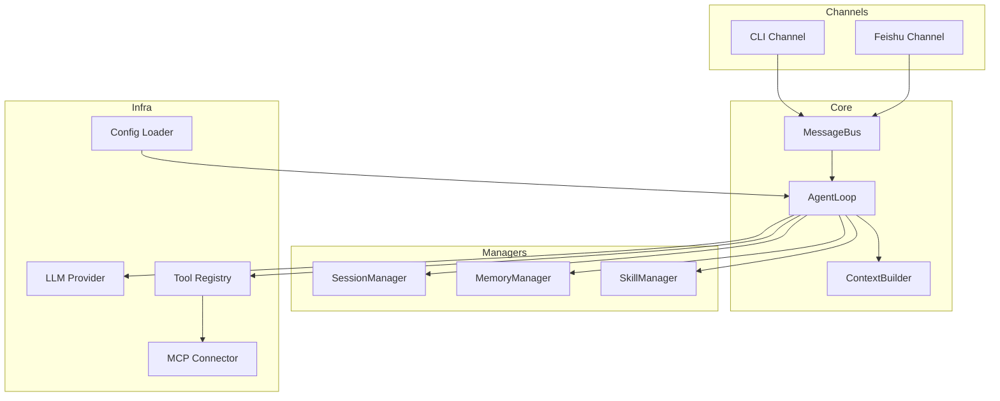
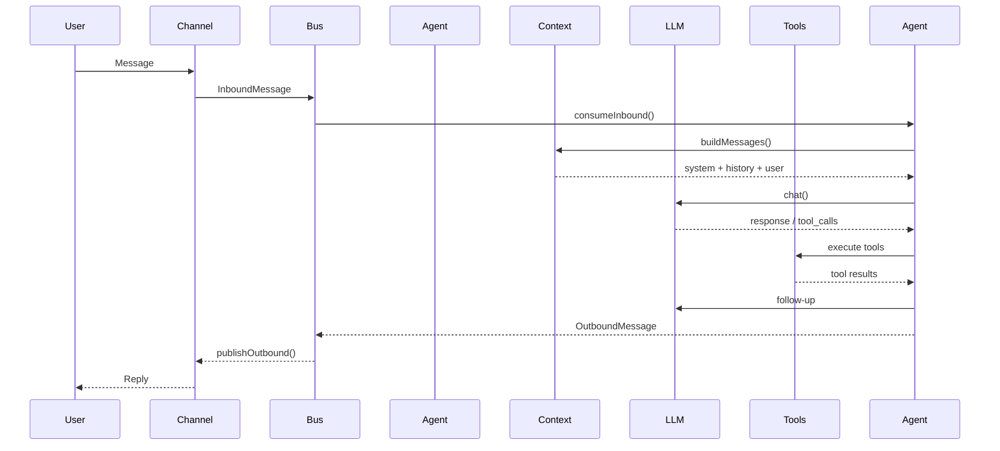
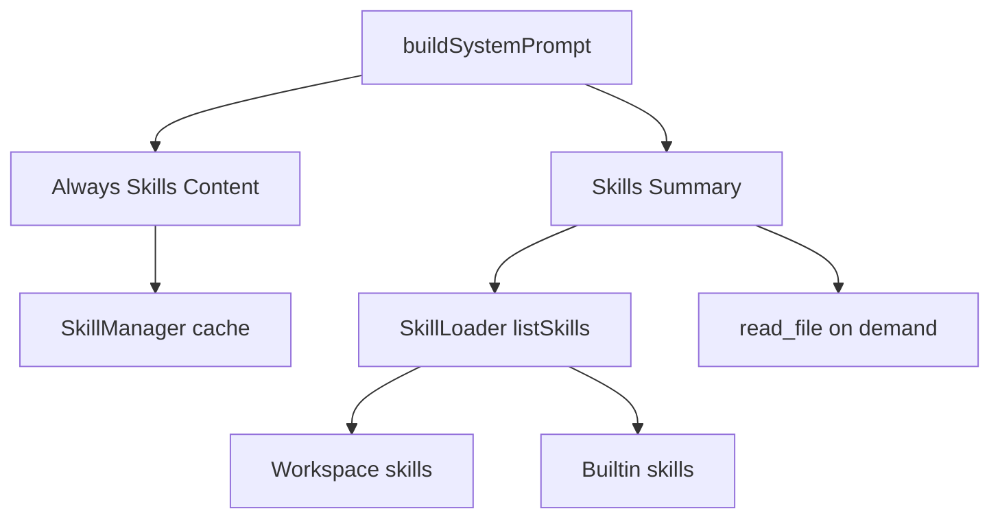

# octobot 🐙

[](https://www.typescriptlang.org/)
[](https://nodejs.org/)
[](../LICENSE)

[English](../README.md) | 简体中文

octobot 是一个 TypeScript 实现的模块化 AI Agent 框架，聚焦多通道交互、会话与记忆管理、技能扩展与工具编排，面向研发流程与自动化工作流。灵感来自 [nanobot](https://github.com/danielmiessler/nanobot)。

## 核心亮点

- 多 LLM 支持（OpenAI、Anthropic、VolcEngine、DeepSeek、Gemini、智谱、Moonshot 等）
- 多通道接入（CLI 与飞书机器人）
- 双层记忆（MEMORY.md + HISTORY.md）
- 基于 SKILL.md 的技能系统（依赖检查 + 按需加载）
- MCP 集成（Model Context Protocol）
- 消息总线解耦通道与核心循环
- 工具体系覆盖文件、执行、搜索、抓取、子代理与定时任务
- JSONL 会话持久化与多会话并发

## 快速开始

### 安装（推荐）

```bash
npm i -g octobot
```

### 源码安装

```bash
git clone https://github.com/yourusername/octobot.git
cd octobot
npm install
npm run build
npm link
```

### 初始化

```bash
octobot onboard
```

### 配置

配置文件：`~/.octobot/config.json`

```json
{
  "agents": {
    "defaults": {
      "workspace": "~/.octobot/workspace",
      "model": "ark-code-latest",
      "provider": "volcengine",
      "max_tokens": 8192,
      "temperature": 0.1,
      "max_tool_iterations": 40,
      "memory_window": 100
    }
  },
  "providers": {
    "volcengine": {
      "api_key": "YOUR_API_KEY",
      "api_base": "https://ark.cn-beijing.volces.com/api/coding/v3"
    }
  },
  "tools": {
    "web": {
      "search": {
        "api_key": "TAVILY_API_KEY",
        "max_results": 5
      }
    },
    "exec": {
      "timeout": 60,
      "path_append": ""
    },
    "restrict_to_workspace": false
  },
  "channels": {
    "feishu": {
      "enabled": false,
      "app_id": "",
      "app_secret": ""
    }
  }
}
```

### 运行

```bash
# 启动 CLI 交互对话
octobot agent

# 启动飞书网关（需要配置 channels.feishu）
octobot gateway
```

## 使用指南

### CLI

```text
› 你好
octobot: 你好！有什么需要我协助的吗？
```

### 飞书

1. 在飞书开放平台创建机器人
2. 配置 `channels.feishu.app_id` 和 `channels.feishu.app_secret`
3. 运行 `octobot gateway`
4. 在飞书中 @ 机器人开始对话

## 工具与技能

### 内置工具

| 工具 | 描述 |
|------|------|
| `read_file` | 读取文件内容 |
| `write_file` | 写入文件内容 |
| `edit_file` | 编辑文件内容 |
| `list_dir` | 列出目录 |
| `exec` | 执行命令（安全校验与超时控制） |
| `web_search` | 网络搜索（Tavily） |
| `web_fetch` | 网页抓取并抽取可读内容 |
| `message` | 发送消息 |
| `spawn` | 子代理任务 |
| `cron` | 定时任务 |

### 技能格式

技能目录：`{workspace}/skills/<skill>/SKILL.md`

```markdown
---
name: tmux
description: Control tmux sessions
always: false
metadata: {"octobot": {"requires": {"bins": ["tmux"]}}}
---

# tmux Skill
Use tmux to manage terminal sessions...
```

## 架构概览

- Channels：CLI / Feishu
- Core：AgentLoop + MessageBus
- Managers：Session / Memory / Skills
- Infra：LLM Provider / Tools / Config

### 系统架构图



### 消息流转



### 技能加载



## MCP 扩展

```json
{
  "mcp": {
    "enabled": true,
    "servers": {
      "sqlite": {
        "command": "npx",
        "args": ["-y", "@modelcontextprotocol/server-sqlite", "./data.db"]
      }
    }
  }
}
```

可用 MCP 服务器：https://github.com/modelcontextprotocol/servers

## 开发

```bash
npm run build
npm run start
```

## 贡献

- 运行 TypeScript 类型检查：`npx tsc --noEmit`
- 遵循既有代码风格
- 功能变更需同步文档

## 许可证

[MIT](../LICENSE)

## 致谢

- 灵感来源：[nanobot](https://github.com/danielmiessler/nanobot)
- 飞书 SDK：[@larksuiteoapi/node-sdk](https://github.com/larksuite/node-sdk)
